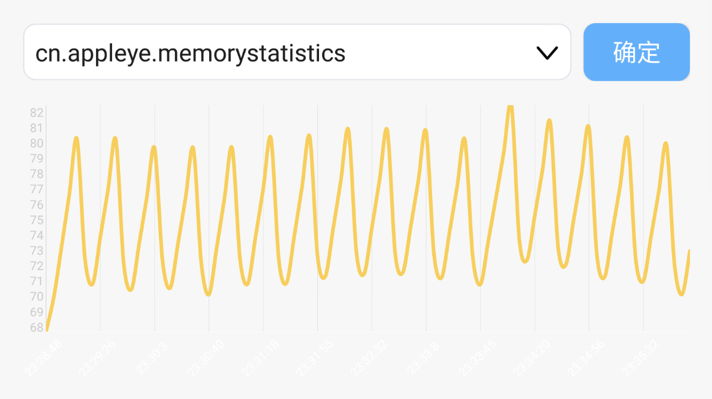

#MemoryStatistics
统计应用内存变化的工具
 
##Feature
- 应用列表功能
- 搜索功能
- 动态显示内存变化功能

##效果

# About
@Author : Liu Liaopu  
@Website : https://github.com/newhope1106

# License
Copyright 2016-2017 Liu Liaopu

Licensed under the Apache License, Version 2.0 (the "License"); you may not use this file except in compliance with the License. You may obtain a copy of the License at

http://www.apache.org/licenses/LICENSE-2.0

Unless required by applicable law or agreed to in writing, software distributed under the License is distributed on an "AS IS" BASIS, WITHOUT WARRANTIES OR CONDITIONS OF ANY KIND, either express or implied. See the License for the specific language governing permissions and limitations under the License.   
